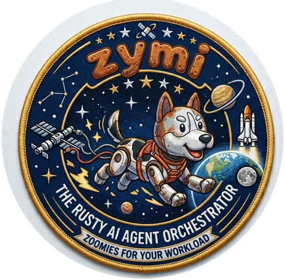

<p align="center">
  
</p>

<h1 align="center">zymi-core</h1>

<p align="center"><em>Event-sourced agent engine for auditable AI workflows — Rust core, Python bindings, YAML configs.</em></p>

<p align="center">
  <a href="https://pypi.org/project/zymi-core/"></a>
  <a href="https://github.com/metravod/zymi-core/actions/workflows/ci.yml"></a>
  <a href="https://docs.rs/zymi-core"></a>
  <a href="LICENSE"></a>
  <a href="https://github.com/metravod/zymi-core/stargazers"></a>
</p>

---

`zymi-core` helps you build agent workflows you can inspect after the fact. Every run is recorded as an immutable event stream in SQLite, agent side effects are mediated through intentions and boundary contracts, and pipelines execute as DAGs with parallel steps when possible.

## Highlights

- **Auditable by default**: every state change is persisted as an event with hash-chain verification.
- **Safer side effects**: agents emit intentions first; contracts and approvals decide what is allowed to execute.
- **Practical workflows**: define agents and DAG pipelines in YAML, then run them from a small CLI.
- **Declarative custom tools**: add HTTP and shell tools in `tools/*.yml` — no Rust code required. `zymi init` includes a working example.
- **MCP client built in**: drop any [Model Context Protocol][mcp] server into `project.yml` and its tools appear as `mcp__<server>__<tool>` — no per-tool schema authoring. Probe new servers with `zymi mcp probe`.
- **Flexible integration points**: use the Rust crate, Python bindings, or both — Python can drive pipelines directly via `Runtime.for_project(...).run_pipeline(...)`, no subprocess.
- **LLM-provider ready**: OpenAI-compatible providers, Anthropic support, Python tools, and LangFuse event services.
- **Automatic context management**: observation masking compresses older tool results in-place (~2x cost reduction, no extra LLM calls), with LLM summarization as a graduated fallback when the context grows further.
- **JSON Schemas for configs**: `zymi schema project|agent|pipeline|tool` outputs draft-07 JSON Schema for IDE autocomplete and LLM-assisted config generation.

[mcp]: https://modelcontextprotocol.io

## Installation

| If you want to... | Install with... |
| --- | --- |
| CLI + Python bindings | `pip install zymi-core` |
| Rust crate only | `zymi-core = "0.2"` |

`pip install zymi-core` gives you both the `zymi` CLI command and the `zymi_core` Python module.

## Quick Start

```bash
# Install
pip install zymi-core

# Create a demo project
mkdir zymi-demo
cd zymi-demo
zymi init --example research

# Add your LLM provider config to project.yml, then run the pipeline
zymi run research -i topic="event sourcing"

# Inspect what happened
zymi events --limit 20
zymi verify
```

For example, this is enough to get started with OpenAI:

```yaml
llm:
  provider: openai
  model: gpt-4o
  api_key: ${env.OPENAI_API_KEY}
```

What this gives you:

- `project.yml` for provider config, policies, contracts, and defaults
- `agents/` for agent definitions
- `pipelines/` for DAG workflows
- `tools/web_search.yml` — a declarative tool example, ready to wire up to a search provider
- `.zymi/events.db` for the append-only event log
- `output/` and `memory/` directories in the research example

### Common CLI commands

```bash
zymi init --name my-project
zymi init --example research
zymi init --example mcp              # scaffold a project wired to an MCP server

zymi run main -i task="Summarize the architecture"
zymi run research -i topic="Rust event sourcing"

# Probe any MCP server without a project dir — see what it advertises
zymi mcp probe fetch -- uvx mcp-server-fetch

# Long-running mode: react to PipelineRequested events from any process
zymi serve research

zymi events
zymi events --stream conversation-1
zymi events --stream conversation-1 --verbose
zymi events --kind tool_call_completed --raw

zymi verify
zymi verify --stream conversation-1

# Discover what's in the project / what has run
zymi pipelines
zymi runs                          # all runs, newest first
zymi runs --pipeline research --limit 20

# Interactive 3-panel TUI: runs ▸ pipeline graph ▸ events
# Inside: Tab cycles panels, Enter expands, f follows tail,
#         Shift+R on a graph node forks-resumes from that step.
zymi observe
zymi observe --run pipeline-research-abc123

# Fork-resume an earlier run from a chosen step (ADR-0018).
# Steps upstream of the fork are frozen — their events are copied verbatim;
# the fork step + DAG-descendants re-run against the current configs on disk.
zymi resume pipeline-research-abc123 --from-step writer
zymi resume pipeline-research-abc123 --from-step writer --dry-run   # preview only

# JSON Schema for configs (useful for IDE autocomplete / LLM generation)
zymi schema project
zymi schema --all
```

## Project Layout

A `zymi` project is just a directory with YAML files:

```text
my-project/
  project.yml
  agents/
    default.yml
  pipelines/
    main.yml
  tools/          # declarative custom tools
    web_search.yml
  .zymi/
    events.db
```

The default scaffold created by `zymi init` is intentionally small:

```yaml
# project.yml
name: my-project
version: "0.1"

defaults:
  timeout_secs: 30
  max_iterations: 10

policy:
  enabled: true
  allow: ["ls *", "cat *", "echo *"]
  deny: ["rm -rf *"]

# optional — tune context window budget
runtime:
  context:
    observation_window: 10
    soft_cap_chars: 400000
    hard_cap_chars: 600000
    min_tail_turns: 4
```

```yaml
# agents/default.yml
name: default
description: "Default agent"
tools:
  - web_search
  - read_file
  - write_memory
max_iterations: 10
```

```yaml
# pipelines/main.yml
name: main

steps:
  - id: process
    agent: default
    task: "${inputs.task}"

input:
  type: text

output:
  step: process
```

The default scaffold also creates `tools/web_search.yml` — a declarative tool with a shell placeholder and commented-out configs for Brave Search, SerpAPI, and Google Custom Search. Uncomment one, set the API key, and the agent's `web_search` tool starts returning real results.

### Declarative Custom Tools

Drop a YAML file into `tools/` to give your agents new capabilities without writing code:

```yaml
# tools/slack_post.yml
name: slack_post
description: "Post a message to a Slack channel"
parameters:
  type: object
  properties:
    channel:
      type: string
    text:
      type: string
  required: [channel, text]
implementation:
  kind: http
  method: POST
  url: "https://slack.com/api/chat.postMessage"
  headers:
    Authorization: "Bearer ${env.SLACK_TOKEN}"
    Content-Type: "application/json"
  body_template: '{"channel": "${args.channel}", "text": "${args.text}"}'
```

Then reference it in an agent:

```yaml
# agents/notifier.yml
name: notifier
tools:
  - web_search
  - slack_post   # ← the custom tool
```

`${env.*}` variables are resolved at parse time; `${args.*}` are resolved at call time from the LLM's arguments. Name collisions with built-in tools are a hard error.

### MCP Servers

Declarative tools cover HTTP and shell. For everything more involved — a filesystem sandbox, a git client, a search index, a proprietary API with its own protocol quirks — [Model Context Protocol][mcp] servers are already a large and growing catalogue, and `zymi-core` speaks the protocol out of the box.

One entry in `project.yml`:

```yaml
mcp_servers:
  - name: fs
    command: [npx, -y, "@modelcontextprotocol/server-filesystem", ./sandbox]
    allow: [read_text_file, write_file, list_directory]  # optional whitelist
    init_timeout_secs: 15
    call_timeout_secs: 30
    restart:
      max_restarts: 2
      backoff_secs: [1, 5]
```

And the agent gets the tools under a namespaced prefix — no per-tool YAML, no Rust, the definitions come from the server's `tools/list` at startup:

```yaml
# agents/default.yml
tools:
  - mcp__fs__read_text_file
  - mcp__fs__write_file
  - mcp__fs__list_directory
```

`zymi run` boots declared servers, waits for their handshakes, and publishes `mcp_server_connected { server, tool_count }`; on shutdown each server gets `mcp_server_disconnected { reason }`. Every tool call is the usual `tool_started` / `tool_finished` pair — the audit trail is identical to any other tool. Only env vars named under `env:` reach the child process (one exception: `PATH` is auto-forwarded so `npx` / `uvx` / `python` resolve), per [ADR-0023](adr/0023-mcp-client-integration.md).

**Try it end-to-end:**

```bash
mkdir zymi-mcp-demo && cd zymi-mcp-demo
zymi init --example mcp
export OPENAI_API_KEY=sk-...
zymi run main -i task="List everything in the sandbox, then write notes.md summarising it."
```

**Before wiring a new server into `project.yml`, probe it:**

```bash
zymi mcp probe <name> -- <command> [args...]

# Examples:
zymi mcp probe fs    -- npx -y @modelcontextprotocol/server-filesystem /tmp
zymi mcp probe fetch -- uvx mcp-server-fetch              # keyless
zymi mcp probe gh    --env GITHUB_PERSONAL_ACCESS_TOKEN=ghp_... \
                     -- npx -y @modelcontextprotocol/server-github
```

`probe` spawns the server, completes the MCP handshake, prints one line per advertised tool, and shuts down cleanly — use its output to pick your `allow:` whitelist.

## Python Bindings

The same `pip install zymi-core` that gives you the CLI also exposes a `Runtime` for running pipelines directly, plus the lower-level `Event`, `EventBus`, `EventStore`, `Subscription`, and `ToolRegistry` primitives for custom integrations.

### Run a pipeline from Python

```python
from zymi_core import Runtime

# Loads project.yml + agents/ + pipelines/ from the given directory and
# builds the same Runtime `zymi run` and `zymi serve` use. `approval` is
# either "terminal" (fail-closed prompt on stdin, matches `zymi run`) or
# "none" (intentions tagged RequiresHumanApproval resolve to a deny).
rt = Runtime.for_project(".", approval="terminal")

result = rt.run_pipeline("research", {"topic": "rust event sourcing"})
print(result.success, result.final_output)
for step in result.step_results:
    print(step.step_id, step.iterations, step.success)
```

`rt.bus()` and `rt.store()` hand out Python wrappers over the runtime's
own `Arc`s, so any subscriber you attach there sees exactly the events
the handler publishes — there is no second bus over the same SQLite file.

### Tool registry and event primitives

```python
from zymi_core import ToolRegistry

registry = ToolRegistry()

@registry.tool
def search(query: str) -> str:
    return f"Results for: {query}"

result = registry.call("search", '{"query":"rust async"}')
intention_json = registry.to_intention("search", '{"query":"rust async"}')
definitions = registry.definitions()
```

For lower-level event primitives the same package gives you the event store and bus directly:

```python
from zymi_core import Event, EventBus, EventStore

store = EventStore("./events.db")
bus = EventBus(store)
subscription = bus.subscribe()

event = Event(
    stream_id="conversation-1",
    kind={"type": "UserMessageReceived", "data": {
        "content": {"User": "Hello"},
        "connector": "python",
    }},
    source="python",
)

bus.publish(event)
received = subscription.try_recv()
```

## Multi-Process Integration (Django, Celery, scripts)

The Python wrapper for `EventStore` opens the same SQLite file the Rust
side uses. There is no second IPC channel — events written from one
process are visible to every other process that opens the same store, and
a long-running `zymi serve` picks them up via a polling tail watcher
(see [ADR-0012](adr/0012-cross-process-event-delivery.md)).

The canonical pattern: a web app publishes a `PipelineRequested` event,
`zymi serve` runs the pipeline, and the result comes back as a
`PipelineCompleted` event with the same `correlation_id`.

Terminal A — long-running Rust service:

```bash
cd my-zymi-project
zymi serve research
```

Terminal B — any Python process (e.g. a Django view):

```python
import uuid
from zymi_core import Event, EventBus, EventStore

store = EventStore(".zymi/events.db")
bus = EventBus(store)

correlation_id = str(uuid.uuid4())
sub = bus.subscribe_correlation(correlation_id)

event = Event(
    stream_id=f"web-req-{correlation_id}",
    kind={"type": "PipelineRequested", "data": {
        "pipeline": "research",
        "inputs": {"topic": "rust event sourcing"},
    }},
    source="django",
)
event.with_correlation(correlation_id)
bus.publish(event)

# Block until the serve process publishes PipelineCompleted with the
# same correlation_id (timeout in seconds).
result = sub.recv(timeout_secs=300)
print(result.kind)  # {"type": "PipelineCompleted", "data": {...}}
```

Because the SQLite store is the single source of truth, you also get
free auditing: `zymi events --stream web-req-...` shows everything that
happened during the run, and `zymi verify` checks the hash chain.

Inside `zymi serve` the `PipelineRequested → RunPipeline` translation is
done by `EventCommandRouter` (see
[ADR-0013](adr/0013-target-runtime-architecture.md)). It is re-exported
from `zymi_core::runtime`, so if you are building your own scheduler or
bot adapter you can wire the same router against your own `Runtime`
without copy-pasting `cli/serve.rs`.

## Rust Crate

Add the crate to your `Cargo.toml`:

```toml
[dependencies]
zymi-core = "0.2"
```

Example:

```rust
use std::sync::Arc;
use zymi_core::{open_store, Event, EventBus, EventKind, Message, StoreBackend};

let store = open_store(StoreBackend::Sqlite { path: "events.db".into() })?;
let bus = EventBus::new(store.clone());

let mut rx = bus.subscribe().await;

let event = Event::new(
    "conversation-1".into(),
    EventKind::UserMessageReceived {
        content: Message::User("Hello".into()),
        connector: "cli".into(),
    },
    "cli".into(),
);

bus.publish(event).await?;
let received = rx.recv().await.unwrap();
assert_eq!(received.kind_tag(), "user_message_received");

let verified_count = store.verify_chain("conversation-1").await?;
```

For cross-process delivery in your own binary, spawn a `StoreTailWatcher`
on the same store/bus — it polls for events written by other processes
and fans them out into local subscribers without re-persisting them:

```rust
use std::time::Duration;
use zymi_core::StoreTailWatcher;

let watcher = StoreTailWatcher::new(store.clone(), bus.clone())
    .with_interval(Duration::from_millis(100))
    .spawn();

// ... later, on shutdown:
watcher.stop().await;
```

## How It Works

`zymi-core` is built around a small set of ideas:

1. **Every meaningful state change becomes an event.** The SQLite event store is the source of truth.
2. **Agents express intentions, not side effects.** Intentions are evaluated against boundary contracts before execution.
3. **Pipelines are DAGs.** Independent steps can run in parallel, while dependencies remain explicit.
4. **Context is event-sourced too.** The agent's working context is reassembled from the event log each iteration — older observations are masked automatically, and hybrid compaction kicks in when the budget is exceeded.
5. **Runs stay replayable.** You can inspect events with `zymi events --stream <id>` and verify hash-chain integrity with `zymi verify`.
6. **Custom tools are declarative.** HTTP tools live in `tools/*.yml` and are dispatched at runtime — no Rust code, no rebuild.

Core intention types include `ExecuteShellCommand`, `WriteFile`, `ReadFile`, `WebSearch`, `WebScrape`, `WriteMemory`, `SpawnSubAgent`, and `CallCustomTool`.

## Feature Flags (Rust crate)

The pip wheel ships with `python` and `cli` enabled. These flags are relevant when depending on the Rust crate directly.

| Feature | Description |
| --- | --- |
| `python` | PyO3 bindings for the `_zymi_core` Python extension module |
| `cli` | The `zymi` CLI binary |
| `runtime` | Async runtime and HTTP dependencies used by runtime integrations |
| `webhook` | HTTP approval handler built on Axum |
| `services` | Event-bus services such as LangFuse |

## Development

```bash
cargo test
cargo test --features services,webhook

cargo clippy -- -D warnings
cargo clippy --features services -- -D warnings

maturin develop --features python,cli
```

## License

MIT
