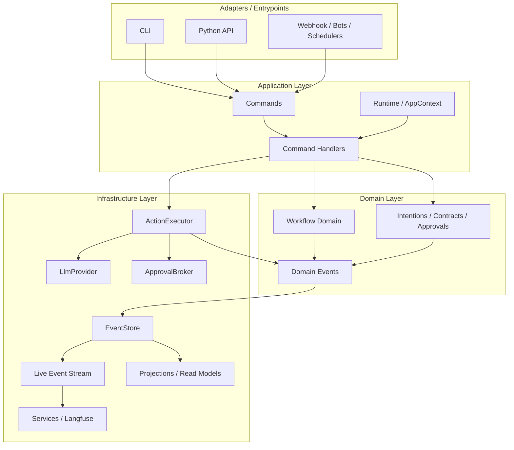
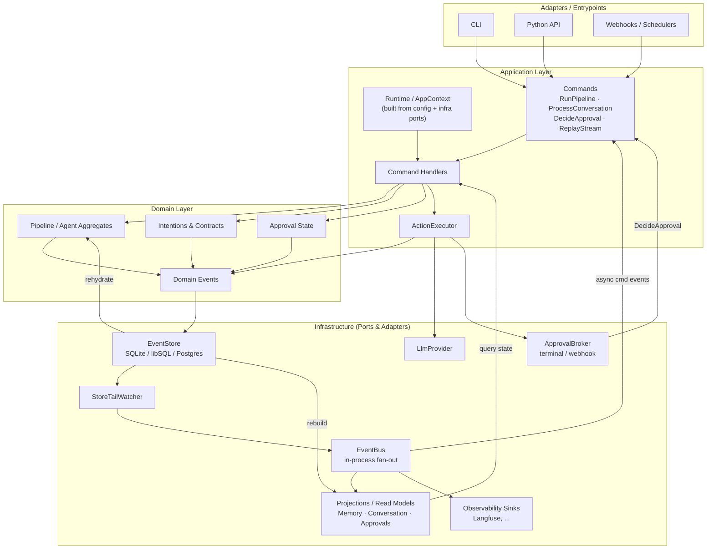

# Target Runtime Architecture (Draft v1.1)

Date: 2026-04-07

Status: Draft — proposed direction for the runtime unification work tracked in `.drift/project.json`. Not yet a committed decision; will be refined into a binding ADR once the first slice (Runtime/AppContext + command/handler shape) lands.

## Context

After ADR-0012 (cross-process event delivery) the system has three live entrypoints — `zymi` CLI, the Python bridge, and `zymi serve <pipeline>` — each wiring its own copy of `EventStore`, `EventBus`, providers, and contracts. The drift goal "Runtime unification" calls for one canonical execution path with a `Runtime/AppContext` builder and a command/handler shape (`RunPipeline`, `ProcessConversation`, `DecideApproval`, `ReplayStream`). Several adjacent goals (action executor split, event-sourced memory, projections/recovery) are downstream of the same architectural shape.

A first sketch of the target was produced as a layered diagram. This ADR records that sketch (v1), the critique of it, and a corrected v1.1 that we will use as the working reference until implementation invalidates it.

## Original sketch (v1)

## What v1 gets right (and v1.1 keeps)

- **CMD → HND with a separate `Runtime/AppContext`** node — matches the command/handler target in the runtime-unification goal.
- **STORE → BUS direction**, not the reverse. This is the answer ADR-0012 already implies: store is the single source of truth, bus is in-process fan-out over persisted events.
- **`ApprovalBroker` as a standalone component**, not embedded in the engine.
- **Projections as first-class consumers**, not bolted on later.
- **Adapters cleanly separated**, with webhooks/schedulers sitting next to CLI and Python now that `zymi serve` exists.

## What v1 gets wrong or leaves out

1. **`ActionExecutor` is placed in Infrastructure.** Executing an Intention is an application/domain concern; only the *ports* it uses (LLM client, HTTP, FS) belong in infra. As drawn, infra emits domain events (`EXEC → EVT`), which inverts the dependency direction.
2. **No read path.** All arrows go handlers → events → store → projections. Nothing flows back from `Projections` into `Handlers`, so the diagram describes a write-only system. Half of CQRS is missing — the half that matters for the event-sourced memory work.
3. **No cross-process command path.** ADR-0012 introduced "command arrives as an event on the bus" (`PipelineRequested` → `zymi serve` → `PipelineCompleted`), but v1 only shows synchronous adapter → command. There is no `BUS → CMD`.
4. **`Workflow Domain` is a flat box.** In an event-sourced system pipelines/agents are aggregates: handler loads them by replaying the store, mutates them, emits new events, persists. The diagram shows only the emit step.
5. **`Runtime/AppContext` has no incoming arrows.** Its whole job is to be *constructed* from config + infra ports, but on v1 it appears as a magic singleton.
6. **The approval loop is half drawn.** `EXEC → APPROVAL` is shown, but the decision returning as a `DecideApproval` command is not.
7. **`Intentions / Contracts / Approvals` are conflated** into one box despite having different lifecycles (Intentions = "what an agent wants", Contracts = policy constraints over intentions, Approvals = decisions about specific intentions).

## Target sketch (v1.1)

### Deltas from v1

1. `ActionExecutor` moved from Infrastructure into Application, next to `Command Handlers`. Infra now contains only ports (`LlmProvider`, `ApprovalBroker`, `EventStore`, etc.).
2. Added `Projections → Handlers` as the CQRS query edge — the read path that v1 was missing.
3. Added `BUS → CMD` ("async cmd events") for the cross-process command path that ADR-0012 already enables via `zymi serve`.
4. `Workflow Domain` renamed to `Pipeline / Agent Aggregates`, with the rehydration loop made explicit: `STORE → AGG → EVT → STORE`.
5. `Intentions & Contracts` and `Approval State` split into two domain boxes.
6. `Runtime / AppContext` annotated as "built from config + infra ports", making the construction direction explicit instead of leaving RT as a free-floating node.
7. Approval loop closed: `APPROVAL → CMD ("DecideApproval")` shows that approval decisions re-enter through the same command path as everything else.
8. Added `StoreTailWatcher` as the named bridge between `STORE` and `BUS` so the diagram matches what is in the code today.
9. `Projections` are fed by both `BUS` (live updates) and `STORE` (rebuild path), instead of only one.

## Open questions (to resolve before this becomes a binding ADR)

- **Aggregates: rehydrate-from-store or read-model-backed?** v1.1 shows handlers loading aggregates by replay from the store. For long-lived pipelines that may be too expensive — a snapshot/projection-backed aggregate is the natural follow-up, but it conflates the "Recovery and projections" goal with this one. We will pick a side once event-sourced memory lands.
- **Where does the async-command router live?** v1.1 draws `BUS → CMD` as one edge, but in code that needs a small subscriber that maps event types to commands. Whether it sits in Application as `EventCommandRouter` or inside each handler is undecided.
- **Crate boundaries vs module boundaries.** The four layers can be enforced as separate crates (`zymi-domain`, `zymi-app`, `zymi-infra`, `zymi-adapters`) or as modules inside `zymi-core` with discipline. Splitting crates pays for itself only if we expect external consumers of the domain layer.
- **`StoreTailWatcher` poll/lag policy** is currently a hidden default (~100ms). It belongs in the runtime contract, not in `events::store::watcher.rs` as a constant. Will be promoted as part of runtime unification.
- **Backpressure on projections.** If a projection lags the bus, do we drop, block, or buffer? Undecided; depends on whether projections become load-bearing (memory read model) or stay read-mostly (audit).

## Consequences

- **Pros**: Gives the runtime unification work a concrete target instead of "command/handler shape, somehow". Makes the read path explicit, so the event-sourced memory goal has a place to land. Surfaces the cross-process command path as a first-class concept rather than an `zymi serve` quirk. Aligns the diagram with what ADR-0012 already shipped.
- **Cons**: Adds one more layer of indirection (Runtime, Commands, Handlers, Executor) over today's direct `engine::run_pipeline`. Migration is non-trivial: every entrypoint and the Python bridge will need to move to the new wiring at the same time, otherwise we end up with three implementations instead of one.
- **Next steps**: (1) land the safety-bug fix (`requires_approval` downgrade) on top of the current shape — it does not depend on this rewrite. (2) Start runtime unification with the smallest viable slice: introduce `Runtime/AppContext` + `RunPipeline` command/handler, port `zymi run` to it, and only then port Python and `zymi serve`. (3) Resolve the open questions above as that slice forces them.
